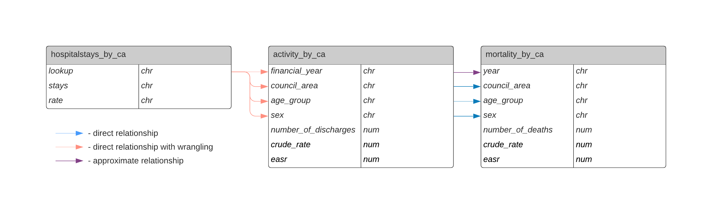

# Project Brief

### Aim
Use publicly available data to improve outcomes for stroke diagnoses in Scotland. 

### Question
**How can Scottish health services most effectively prevent and treat stroke diagnoses?**

### End User and outcomes
My end users are health practitioners and policy makers who are interested in:

* identifying and reproducing succesful strategies in the prevention and treatment of strokes.
* identifying demographic groups most a risk of stroke for targetted intervention.

Original brief accessible in documentation folder of this project.

# Project Plan

### Project requirements

* Understand business questions
* Identify data questions
* Assess relevant available data
* Select data for analysis
* Clean and join selected data
* Answer data questions
* Produce report which answers business questions
* Presentation of the project brief, data and results

### Systems and tools to be used
* RStudio for all exploration, cleaning and analysis.
* Reports and documentation will be produced as R Markdown files, which can be distributed as html or pdf as required by audience
* GitHub used for version control
* Canva used to prepare slides for presentation and dissemination

### Business Questions
* How can Scottish health services most effectively prevent and treat stroke diagnoses?
* What measures have been successful in the treatment and prevention of stroke?
* Which demographics should we target for stroke intervention?

### Derived Data Questions
* What is the most common stroke diagnosis in Scotland?
* Are there any differences in crude rate of hospital stays by health board vs by local authority?
* Are there any differences in stroke diagnoses between different demographics (e.g. sex, age group)?
* Are there differences in mortality rates (mortality EASR) for different types of stroke? Does this vary with demographics?

## Definitions

#### Stroke
* One of three possible diagnoses of Cerebrovascular diseases.
* Used in report and analysis to refer to all Cerebrovascular Diseases to aid ease of understanding.

#### Subarachnoid Haemorrhage
* One of three possible diagnoses of Cerebrovascular diseases.

#### TIAs and other symptoms
* Transient Ischemic Attacks (commonly known as mini-strokes) and other symptoms
* One of three possible diagnoses of Cerebrovascular diseases.

#### Cerebrovascular Disease
* "Cerebrovascular Disease (CVD) is a condition that develops as a result of problems with the blood vessels supplying the brain. This can cause a stroke, a transient ischaemic attack (TIA) or a subarachnoid haemorrhage."
*   - From Scottish Government Stroke Improvement Plan, 2014, accessed at https://www.gov.scot/publications/stroke-improvement-plan/pages/3/
  
## Assumptions

* financial year can be compared to calendar year without signifcantly undermining the analysis

* ambiguously named and defined crude rates in individual datasets refer to the crude rate of the dataset's subject variable.
e.g. EASR and crude rate in mortalitybyca refer to mortality per 100,000, EASR and crude rate in activitybyca refer to discharges per 100,000 and in diagnosis-by-counil-area refer to hospital stays per 100,000.

# Data Assessment

### Sources

* Scottish Stroke Statistics - Stroke Activity By Health Board/Council Area

Provider: Public Health Scotland

Time period: financial years 2009/10 - 2018/19.

Format: .csv for Council Area OR Health Board

Content: Number of discharges and crude rate per 100,000 population by gender, age, sex and council area OR NHS board.

Usage: Used for project

Reason: Provided with brief.

Link: https://www.opendata.nhs.scot/dataset/scottish-stroke-statistics

* Scottish Stroke Statistics - Stroke Mortality By Health Board/Council Area

Provider: Public Health Scotland

Time period: 2009 - 2018

Format: .csv for Council Area OR Health Board

Content: Number of mortalities and crude rate per 100,000 population by gender, age, sex and council area OR NHS board.

Usage: Used for project

Reason: Provided with brief. Mortality used as a measure of outcomes.

Link: https://www.opendata.nhs.scot/dataset/scottish-stroke-statistics

* Inpatient and Daycare Administrative Dataset 
Provider: Public Health Scotland's Data and Intelligence

Time period: Annual data from financial years 2014/15 to 2018/19

Format: .xlsx file of 4 sheets for Council Area OR Health Board

Content: Hospital stays and crude rate per 100,000 population by gender, age, sex and council area OR NHS board.

Usage: Used for project

Reason: Hospital stays provides a useful proxy for incidence rate of stroke diagnoses.

Link: https://www.isdscotland.org/Health-Topics/Hospital-Care/Diagnoses/

* National Stroke Statistics

Provider: Public Health Scotland's Data and Intelligence

Time period: Annual data from 2011-2020

Format: One .csv file per year and metric grouping.

Content: Information on hospital activity, operations, incidence, 30-day survival following first emergency admission, GP prescribing, mortality and ambulance service activity.

Usage: Not used for project 

Reason: Time required to assimilate data

Link: https://beta.isdscotland.org/find-publications-and-data/conditions-and-diseases/stroke-statistics/scottish-stroke-statistics/

* Quality and Outcomes Framework

Provider: Public Health Scotland's Data and Intelligence

Time period: 2004 - 2016

Format: Varied

Content: Overall outcome meausurement for health at different levels (GP, Health board, HSCP)

Usage: Not used for project

Reason: Not directly relevant to question.

Link: https://www.isdscotland.org/Health-Topics/General-Practice/Quality-And-Outcomes-Framework/

* Scottish Stroke Improvement Programme Reports

Provider: Scottish Stroke Care Audit

Time period: 2016-2020 (additionally Scottish Stroke Care Audit: 2008-2015)

Format: Varied. Produced annually

Content: Reports improvements against stroke targets, such as number of patients receiving stroke care within time target.

Usage: Not used for project

Reason: Time required to assimilate data

Link: https://www.strokeaudit.scot.nhs.uk/Reports/Reports.html

* Waiting Times Datasets

Provider: Public Health Scotland

Time period: Varied

Format: Varied

Content: Diagnostic waiting times - endoscopy and radiology only

Stage of Treatment- completed waits by specialism

Monthly Emergency Dept Activiity and Waiting times - the number of attendances that are admitted, transferred or discharged within four hours of arrival.
18 weeks to referal - number of patients who started treatment within 18 weeks of referral

Usage: Not used for project

Reason: Time required to assimilate data

Link: https://www.opendata.nhs.scot/organization/isd?q=waiting+times&sort=score+desc%2C+metadata_modified+desc

* Scottish Health Survey

Provider: Scottish Government

Time period: 2011- 2020

Format: Varied

Content: self-reported measure of health, alcohol, mental wellbeing, activity, diet, smoking, etc

Usage: Not used for project

Reason: Not directly relevant to question.

Link:  https://www.gov.scot/collections/scottish-health-survey/


### Quality 

All data sourced government or affiliates meeting relevant standards.
Scottish Stroke Statistics include statistical qualifiers, which have not been explored in this project, but can be accessed at https://www.opendata.nhs.scot/dataset/statistical-qualifiers/resource/b80f9af0-b115-4245-b591-fb22775226c4

Discrepancies between datasets over the age groupings used and the use of calendar versus financial year.

Significant number of NAs in all data. Left as is in cleaning script to be assessed for each analysis question.

### Bias

As these are national datasets, minimal bias is expected.
It is worth keeping in mind the variables which affect access to and usage of public health services such as language barriers, citizenship status, distance to services or mistrust of public services, but these biases will not affect the quality of the analysis.

Non-exhaustive list of publications relating to access to healthcare by demographic:
Use of secondary care in England by international immigrants https://journals.sagepub.com/doi/abs/10.1258/jhsrp.2010.010097
Gypsy, Roma and Traveller access to and engagement with health services: a systematic review https://pubmed.ncbi.nlm.nih.gov/29346666/
Factors associated with access to care and healthcare utilization in the homeless population of England https://academic.oup.com/jpubhealth/article/39/1/26/3065715

### Ethics and Confidentiality

No ethical or confidentiality considerations regarding these datasets, which are public access with Open Government Licences.
The diagnosis data has been cleaned of identifiable data prior to publication. 

### Structure

```{r, echo=FALSE, out.width = '100%'}

```

# Domain expert collaboration

Collaborate with experienced data analysts at CodeClan to discuss the most suitable metric for each of question.