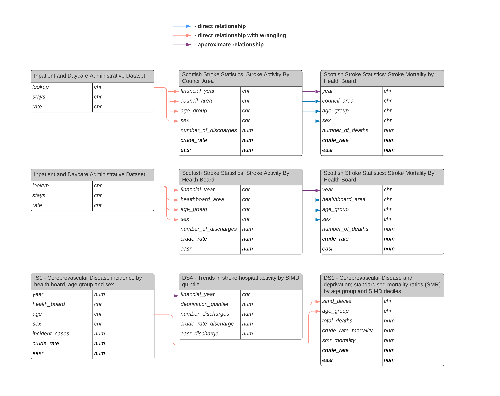

#### Aim

**How can Scottish health services most effectively prevent and treat stroke diagnoses?**

This project examines data on stroke diagnosis in Scotland to inform decision making on stroke care and intervention for public health bodies.

#### Background

* Stroke is a disease of the cerebrovascular system, the system which supplies blood to the brain.
* Cerebrovascular disease include stroke, SH or Transient Ischemic Attacks (commonly known as mini-strokes).
* The treatment and prevention of stroke is a national clinical priority for Scotland
* Scotland has launched major stroke care plans in 2009 and 2014.

#### Data and Methodology

* This project uses publicly available published by Public Health Scotland
* Available data covers the years 2009-2018
* The data includes information on hospital activity (stays and  discharges), mortality rates and incidence rates.
* Demographic detail varies by dataset and include age, gender, Council Area or Health Board and SIMD (Scottish Index of Multiple Deprivation)
* Data is cleaned, analysed and presented in R using Rstudio and Tidyverse.

# Analysis - findings and visualisations


```{r setup, include = FALSE}
knitr::opts_chunk$set(echo = FALSE, message = FALSE, warning = FALSE, out.width = '100%')
library(tidyverse)
```

```{r}
council_strokesbyca <- read_csv("../data/clean_data/strokes_byca.csv",
                                col_types = cols(hospitalstays = col_double(),
                                            crude_rate_stays = col_double()))
healthboard_strokesbyhb <- read_csv("../data/clean_data/strokes_byhb.csv",
                                col_types = cols(hospitalstays = col_double(),
                                            crude_rate_stays = col_double()))

council_strokesbyca <- read_csv("../data/clean_data/strokes_byca.csv",
                                col_types = cols(hospitalstays = col_double(),
                                            crude_rate_stays = col_double()))
healthboard_strokesbyhb <- read_csv("../data/clean_data/strokes_byhb.csv",
                                col_types = cols(hospitalstays = col_double(),
                                            crude_rate_stays = col_double()))

incidence_by_hb <- read_csv("../data/clean_data/incidence_byhb.csv")

discharges_bysimd <- read_csv("../data/clean_data/discharges_bysimd.csv")

mortality_bysimd <- read_csv("../data/clean_data/mortality_bysimd2013-2017")
```

\n
\n
#### What is the most common stroke diagnosis in Scotland?

**Table summarising key metrics by diagnosis**

```{r}
knitr::kable(council_strokesbyca %>% 
  group_by(diagnosis) %>% 
  summarise(avg_discharge_easr = mean(easr_discharge, na.rm = TRUE),
            avg_deaths_easr = mean(easr_mortality, na.rm = TRUE),
            prop_death_by_discharge = avg_deaths_easr / avg_discharge_easr * 100) %>% 
  rename("Diagnosis" = "diagnosis",
         "Discharge (EASR)" = "avg_discharge_easr",
         "Mortality (EASR)" = "avg_deaths_easr",
         "Number of Deaths per 100 Discharges" = "prop_death_by_discharge")
)
```
* For both healthboard and council area, CD is the most common stroke diagnosis recorded for hospital stays, hospital discharges and deaths.

#### Are there differences in mortality rates for different types of stroke? Does this vary with demographics?


```{r}
council_strokesbyca %>% 
# filter year to remove high values from years prior to 2013 in order to make graph more readable
  filter(approx_year > 2013) %>% 
  group_by(age_group, approx_year, diagnosis) %>% 
  summarise(mortality = mean(easr_mortality, na.rm = TRUE)) %>% 
  ggplot() +
  aes(x = approx_year, y = mortality, group = diagnosis, col = diagnosis) +
  geom_line() +
  facet_wrap(~age_group) +
  labs(
    title = "Mortality by age and diagnosis over time",
    x = "Year",
    y = "Mortality (EASR)"
  )
```

* CD is the biggest killer per 100 discharges from hospital followed by Stroke and SH.
* Mortality rates have fallen for the 75+ group with CD and Stroke.
* Mortality rates have remained static for all other age and diagnosis groupings.
```{r}
healthboard_strokesbyhb %>% 
  group_by(healthboard_area_named, diagnosis) %>%
  summarise(mortality = mean(easr_mortality, na.rm = TRUE)) %>% 
  ggplot() +
    aes(x = healthboard_area_named, y = mortality, group = diagnosis, fill = diagnosis) +
  geom_col(position = "fill") +
  coord_flip() +
  theme(axis.text.x = element_text(angle = 90, vjust = 0.5, hjust=1)) +
  labs(
    title = "Proportion of Mortalities by Diagnosis",
    x = "Health Board",
    y = "Mortality (EASR)"
  )
```

* Slightly higher mortality from stroke in Shetland vs normal distribution of deaths per diagnosis.
```{r}
council_strokesbyca %>% 
  group_by(sex, age_group, diagnosis) %>%
  summarise(mortality = mean(easr_mortality, na.rm = TRUE)) %>% 
  ggplot() +
    aes(x = age_group, y = mortality, group = diagnosis, fill = diagnosis) +
  geom_col(position = "fill") +
  facet_wrap(~sex) +
  theme(axis.text.x = element_text(angle = 90, vjust = 0.5, hjust=1)) +
  labs(
    title = "Proportion of mortalitis by age, diagnosis and gender",
    x = "Age Group",
    y = "Mortality (EASR)"
  )
```

* Younger women with SH are dying more often from SH than males.
* Men in the 45-64 age group are more likely to die from stroke.

#### Are there any differences in reporting between health board and local authority?

* No significant discrepancies found.

#### Are there any differences in stroke diagnoses between different demographics?

##### Gender

```{r}
council_strokesbyca %>% 
  filter(diagnosis != "TIAs and related syndromes") %>% 
  group_by(sex, diagnosis) %>%
  summarise(mortality = mean(easr_mortality, na.rm = TRUE)) %>% 
  ggplot() +
    aes(x = diagnosis, y = mortality, group = sex, fill = sex) +
  geom_col(position = "fill") +
  labs(
    title = "Proportion of mortalities for each diagnosis",
    subtitle = "Separated by gender",
    x = "Diagnosis",
    y = "Mortality (EASR)"
  )
```

* Women die from SH proportionally more than men.

```{r}
incidence_by_hb %>% 
  group_by(sex, year) %>% 
  summarise(incidence = mean(easr, na.rm = TRUE)) %>% 
  ggplot() +
  aes(x = year, y = incidence, group = sex, col = sex) +
  geom_line() +
  geom_point() +
  labs(
    title = "Incidents by Gender 2009-2018",
    x = "Year",
    y = "Incidents (EASR)"
  )
```
  
* Men have higher rates of incidence than women.

<details>
<summary>**See Mortality by Gender**</summary>
```{r}
council_strokesbyca %>% 
  group_by(sex, approx_year) %>% 
  summarise(mortality = mean(easr_mortality, na.rm = TRUE)) %>% 
  ggplot() +
  aes(x = approx_year, y = mortality, group = sex, col = sex) +
  geom_line() +
  geom_point() +
  labs(
    title = "Mortality by Gender 2009-2018",
    x = "Year",
    y = "Mortality (EASR)"
  )
```
</details>


* All genders trending in decrease of incidents
* Female incidence rates are the most volatile.
* Female incidents rising since 2016.
* Mortality does not vary significantly with gender
* Although men have higher incidence rates than women, they have similar levels of mortality. i.e. more women die per episode of stroke diagnosis than men.

##### Age

**Table summarising key metrics by age group**
```{r}
knitr::kable(council_strokesbyca %>% 
  group_by(age_group) %>% 
  summarise(avg_discharge_easr = mean(easr_discharge, na.rm = TRUE),
            avg_deaths_easr = mean(easr_mortality, na.rm = TRUE),
            prop_death_by_discharge = avg_deaths_easr / avg_discharge_easr * 100) %>% 
  rename("Age Group" = "age_group",
         "Discharge (EASR)" = "avg_discharge_easr",
         "Mortality (EASR)" = "avg_deaths_easr",
         "Number of Deaths per 100 Discharges" = "prop_death_by_discharge")
)
```

* Mortality, discharge and proportion of deaths per discharge increase with age.
* Mortality by stroke has decreased significantly for the over 75 group between 2009 and 2018
* Mortality rates for all other age groups have remained static in this time


```{r}
council_strokesbyca %>%
  group_by(age_group, diagnosis) %>%
  summarise(discharges = mean(easr_discharge, na.rm = TRUE)) %>% 
  ggplot() +
    aes(x = age_group, y = discharges, group = diagnosis, fill = diagnosis) +
  geom_col(position = "fill") +
  coord_flip() +
  theme(axis.text.x = element_text(angle = 90, vjust = 0.5, hjust=1)) +
  labs(
    title = "Proportion of hospital activity by diagnoses and age group",
    x = "Age group",
    y = "Discharges (EASR)"
  )
```


* Stroke discharges increase with age group.
* CD is the most common diagnosis and accounts for consistent proportion of discharges across all age groups.
* SH accounts for a proportion of hospital activity in younger age groups than in older age groups.

```{r}
council_strokesbyca %>%
  group_by(age_group, diagnosis) %>%
  summarise(mortality = mean(easr_mortality, na.rm = TRUE)) %>% 
  ggplot() +
    aes(x = age_group, y = mortality, group = diagnosis, fill = diagnosis) +
  geom_col(position = "fill") +
  coord_flip() +
  theme(axis.text.x = element_text(angle = 90, vjust = 0.5, hjust=1)) +
  labs(
    title = "Proportion of mortalities by diagnoses and age group",
    x = "Age Group",
    y = "Mortality (EASR)"
  )
```

* Stroke accounts for consistent proportion of mortalities across all age groups.
* CD is the highest killer for all age groups and proportion of death by CD increases with age.
* SH causes a higher proportion of fatalities in younger age groups than in older age groups.

```{r}
council_strokesbyca %>%
  group_by(age_group, diagnosis) %>%
  summarise(discharges = mean(easr_discharge, na.rm = TRUE),
            mortality = mean(easr_mortality, na.rm = TRUE)) %>% 
  ggplot() +
    aes(x = age_group, y = mortality / discharges * 100, 
        group = diagnosis, fill = diagnosis) +
  geom_col(position = "dodge") +
  theme(axis.text.x = element_text(angle = 90, vjust = 0.5, hjust=1)) +
  labs(
    title = "Mortality per 100 discharges",
    subtitle = "Broken down by diagnoses and age group",
    x = "Age Group",
    y = "Rate of Mortality by Discharges (%)"
  )
```

* Number of deaths per 100 discharges increases with age group.
* SH is the most fatal diagnosis for all groups under 75 years.
* Death by stroke does not increase as significantly for stroke diagnosis in the 75 plus age group as it does for all other age groups.
* No trends found in SH diagnosis by age over time

##### Gender and Age


```{r}
percent_table <- incidence_by_hb %>%
  group_by(age, sex) %>% 
  summarise(incidence = mean(easr, na.rm = TRUE)) %>% 
  rename("age_group" = "age")

healthboard_strokesbyhb %>%
  group_by(age_group, sex) %>% 
  summarise(mortality = mean(easr_mortality, na.rm = TRUE)) %>% 
  inner_join(percent_table) %>% 
  ggplot() +
  aes(x = age_group, y = mortality / incidence * 100, group = sex, fill = sex) +
  geom_col(position = "dodge") +
  labs(
    title = "Deaths per 100 incidents",
    subtitle = "Grouped by age and gender",
    x = "Age group",
    y = "Rate of Mortality by Incident (%)"
  )
```
* Men have slightly higher mortality rates for all age groups under 74.
* For the 75+ group, women have the highest mortality.

* Men have the highest incidence rates for all age groups.

* From 45 years upwards, women have the highest number of deaths per incident. 
* From 0-44 years males have the highest number of deaths per incident

##### Healthboard

**Table summarising key metrics by health board**
```{r}
healthboard_table <- healthboard_strokesbyhb %>% 
  group_by(healthboard_area_named) %>% 
  summarise(mortality = mean(easr_mortality, na.rm = TRUE)) 

knitr::kable(healthboard_table <- incidence_by_hb %>% 
  group_by(health_board) %>% 
  summarise(incidence = mean(easr, na.rm = TRUE)) %>%
  mutate(health_board = if_else(
    str_detect(health_board, "NHS"),
    str_sub(health_board, start = 5, end = -1),
    health_board
    )
  ) %>% 
  full_join(healthboard_table, by = c("health_board" = "healthboard_area_named")) %>% 
  arrange(desc(incidence)) %>% 
  rename("Health Board" = "health_board",
         "Incidents (EASR)" = "incidence",
         "Mortality (EASR)" = "mortality")
)
```

* No significant differences in mortality by health boards (maximum of 12.5 deaths per 100,000 population adjusted).
* Differences in number of incidents by health board of up 100 cases per 100,000 (adjusted) between different healthboards.
* Greater Glasgow & Clyde have the highest incidences and Orkney has the lowest.

```{r}
healthboard_table %>% 
    rename("health_board" = "Health Board",
         "incidence" = "Incidents (EASR)",
         "mortality" = "Mortality (EASR)") %>% 
  ggplot(aes(x = incidence, y = mortality)) +
  geom_point() +
  geom_smooth(method = "lm", se = FALSE) +
  geom_text(aes(label = health_board), hjust = -.2) +
  labs(
    title = "Mortalities per incident by Health Board",
    x = "Number of Incidents (EASR)",
    y = "Number of Mortalities (EASR)"
  )
```

* Higher mortalities per incidence in Lanarkshire, Highlands, Grampian and Western Isles.
* Lower mortalities per incidence in the Borders, Tayside, Lothian and Fife.

##### Council

<details>
<summary>**See table summarising mortality by Council Area**</summary>
```{r}
knitr::kable(council_strokesbyca %>% 
  group_by(council_area_named) %>% 
  summarise(mortality = mean(easr_mortality, na.rm = TRUE)) %>% 
  arrange(desc(mortality)) %>% 
  rename("Council Area" = "council_area_named",
         "Mortality (EASR)" = "mortality")
)
```
</details>

* There is a difference in stroke mortality of up to 25 per 100,000 between different council areas. 
* Highest adjusted mortality in Inverclyde and Renfrewshire.
* Lowest adjusted mortality rates in East Renfrewshire and East Dunbartonshire.

<details>
<summary>**See graph Council mortality rates over time for the 10 highest and lowest mortality rate councils (2009-2018 average rates)**</summary>
```{r}
high_mortality_council <- council_strokesbyca %>% 
  group_by(council_area_named) %>% 
  summarise(mortality = mean(easr_mortality, na.rm = TRUE)) %>% 
  slice_max(mortality, n = 10) %>% 
  pull(council_area_named)

low_mortality_council <- council_strokesbyca %>% 
  group_by(council_area_named) %>% 
  summarise(mortality = mean(easr_mortality, na.rm = TRUE)) %>% 
  slice_min(mortality, n = 10) %>% 
  pull(council_area_named)

council_strokesbyca %>% 
  filter(council_area_named %in% high_mortality_council |
           council_area_named %in% low_mortality_council) %>% 
  mutate(high_low = if_else(
    council_area_named %in% high_mortality_council, "high", "low"
  )) %>% 
  group_by(high_low, approx_year) %>% 
  summarise(mortality = mean(easr_mortality, na.rm = TRUE)) %>% 
  ggplot() +
  aes(x = approx_year, y = mortality, group = high_low, col = high_low) +
  geom_line() +
  geom_point() +
  labs(
    title = "Council mortality rates over time for the 10 highest and lowest mortality rate councils (2009-2018 average rates)",
    x = "Year",
    y = "Mortality (EASR)"
  )
```
</details>

* Council mortality rates over time for the 10 highest and lowest mortality rate councils (2009-2018 average rates) show greatest divergence in 2010 and 2015.

```{r}
high_mortality_council_2018 <- council_strokesbyca %>% 
  filter(approx_year == 2018) %>% 
  group_by(council_area_named) %>% 
  summarise(mortality = mean(easr_mortality, na.rm = TRUE)) %>% 
  slice_max(mortality, n = 10) %>% 
  pull(council_area_named)

low_mortality_council_2018 <- council_strokesbyca %>%  
  filter(approx_year == 2018) %>% 
  group_by(council_area_named) %>% 
  summarise(mortality = mean(easr_mortality, na.rm = TRUE)) %>% 
  slice_min(mortality, n = 10) %>% 
  pull(council_area_named)

council_strokesbyca %>% 
  filter(council_area_named %in% high_mortality_council_2018 |
           council_area_named %in% low_mortality_council_2018) %>% 
  mutate(high_low = if_else(
    council_area_named %in% high_mortality_council_2018, "high", "low"
  )) %>% 
  group_by(high_low, approx_year) %>% 
  summarise(mortality = mean(easr_mortality, na.rm = TRUE)) %>% 
  ggplot() +
  aes(x = approx_year, y = mortality, group = high_low, col = high_low) +
  geom_line() +
  geom_point() +
  labs(
    title = "Adjusted mortality rates by council",
    subtitle = "Mortality rates for the 10 highest and lowest adjusted mortality rates council areas",
    x = "Year",
    y = "Mortality (EASR)"
  )
```


* The 10 councils with the highest recent mortality rates showed increase in adjusted mortality in 2013, 2015 and 2018 with an overall downward trend.
* The 10 councils with the lowest recent mortality rates show much more stable decline excluding a rise in mortalities in 2013.

##### SIMD


```{r}
discharges_bysimd %>% 
  mutate(approx_year = as.character(approx_year)) %>% 
  group_by(deprivation_quintile, approx_year) %>% 
  summarise(avg_discharges = mean(easr_discharge, na.rm = T)) %>% 
  ggplot(aes(x = approx_year, y = avg_discharges, group = deprivation_quintile, col = deprivation_quintile)) +
  geom_line() +
  geom_point() +
  labs(
    title = "Hospital activity by SIMD quintile over time"
  )
```

* Hospital activity increases with deprivation.
* Difference between hospital activity rates for deprivation quintiles is increasing over time, particularly for the 2 most deprived quintiles.

**Table showing standardised mortality rates by SIMD decile**
```{r}
knitr::kable(mortality_bysimd %>% 
  group_by(simd_decile) %>% 
  summarise(mortality = mean(smr_mortality)) %>% 
  rename("Decile" = "simd_decile",
         "Mortality (SMR)" = "mortality")
)
```

* Mortalities increase with deprivation.
* Chance of dying from stroke doubles from the least to the most deprived deciles.


##### Age Group and SIMD


```{r}
mortality_bysimd %>% 
  group_by(simd_decile, age_group) %>% 
  filter(age_group != "All") %>% 
  summarise(avg_mortality = mean(smr_mortality, na.rm = T)) %>% 
  ggplot(aes(x = simd_decile, y = avg_mortality, group = age_group, fill = age_group, col = age_group)) +
  geom_col(position = "dodge") +
  labs(
    title = "Adjusted stroke mortality rates by SIMD",
    x = "SIMD Decile",
    y = "Mortality (SMR)"
  )
```
* Mortality is higher for those in the most deprived decile.
* SIMD has the highest impact on mortality for the under 65 age group. 
* 189.5 people per 100,000 under 65 (adjusted) die of strokes in the most deprived decile, compared to just 42.3 of those in the least deprived decile.

# Key findings and Recommendations

### How can Scottish health services most effectively prevent and treat stroke diagnoses?

#### What measures have been successful in the treatment and prevention of stroke?

Due to the timeframe, this project did not explore the impact of different treatment and prevention strategies.
However, the analysis does highlight significant changes at various time points and differences in demographic groupings which can give direction to further research into the effect of intervention and treatment strategies.

**Finding**
Mortality rates have fallen for the 75+ group with CD and Stroke, but not for any other age and diagnosis group

**Recommendation**
* Research interventions for this age group and diagnosis

**Findings**
Council mortality rates over time for the 10 highest and lowest mortality rate councils (2009-2018 average totals by mean) show greatest divergence in 2010 and 2015.
The 10 councils with the highest recent mortality rates showed increase in adjusted mortality in 2013, 2015 and 2018 with an overall downward trend.
The 10 councils with the lowest recent mortality rates show much more stable decline excluding a rise in mortalities in 2013.

**Recommendations**
* Research dissemination and implementation of the 2009 and 2014 stroke action plans, particularly focussing on changes in treatmen and intervention at council level.
* Conduct research into mortalities in 2013.
* Explore the impact of council policies and politics on health measures.


#### Which demographics should we target for stroke intervention?

**Finding**
CD is the highest killer for all age groups.
Proportion of death by CD increases with age.

**Recommendation**
* Further analysis to identify succesful treatment of CD.

##### Gender

**Findings**
Female incidence rates are the most volatile.
Female incidents rising since 2016.
More women die per episode of stroke diagnosis than men.
Women die from SH proportionally more than men.

**Recommendations**
* Model social factors which contribute to stroke incidence and mortality in women, such as smoking, high blood pressure, caring duties, mental wellbeing.
* Compare diagnosis rates on presentation and discharge hospital to identify whether misdiagnosis of SH is more common in women.
* Conduct research on the understanding and identification of SH in women.
* Identify or develop successful treatment and intervention plans for SH.
* Information campaign on stroke symptoms and when to visit the hospital targetted for women's symptoms and concerns.

##### Age

**Findings**
SH causes a higher proportion of fatalities in younger age groups than in older age groups.
SH is the most fatal diagnosis for all groups under 75 years.

**Recommendations**
* Compare diagnosis rates on presentation and discharge hospital to identify whether misdiagnosis of SH varies with age.
* Conduct research on the understanding and identification of SH in young people.
* Identify or develop successful treatment and intervention plans for SH.

##### SIMD

**Findings**
Difference between hospital activity rates for deprivation quintiles is increasing over time, particularly for the 2 most deprived quintiles.
Chance of dying from stroke doubles from the least to the most deprived deciles.
SIMD has the highest impact on mortality for the under 65 age group. 
189.5 people per 100,000 under 65 (adjusted) die of strokes in the most deprived decile, compared to just 42.3 of those in the least deprived decile.

**Recommendations**
* Model social factors which contribute to stroke incidence and mortality over time, with a view to identifying why discrepancy by SIMD is increasing over time.
* Targetted interventions, such as screenings and information campaigns, for under 65s in most deprived areas.


# Additional Information

#### Definitions

**Cerebrovascular Disease**

* Cerebrovascular Disease (CVD) is a condition that develops as a result of problems with the blood vessels supplying the brain. 
* Cerebrovascular diseases include stroke, a transient ischaemic attack (TIA) or a subarachnoid haemorrhage.

**Stroke**

* A stroke occurs when an area of the brain is deprived of its blood supply because of a blockage of a blood vessel supplying the brain.
* One of three possible diagnoses of Cerebrovascular diseases.
* Used in report and analysis to refer to all Cerebrovascular Diseases to aid ease of understanding.

**Subarachnoid Haemorrhage**

* A leak of blood as a result of the rupture of one of the blood vessels beneath one of the layers of membrane that covers the brain.
* One of three possible diagnoses of Cerebrovascular diseases.

**Transient Ischemic Attack / TIA**

* A transient ischemic attack is a temporary disruption to the blood supply to the brain as a result of a blockage of a blood vessel supplying the brain.
* Transient Ischemic Attacks (commonly known as mini-strokes) and other symptoms
* One of three possible diagnoses of Cerebrovascular diseases.

**Crude Rate**

* Occurence per 100,000 population

**EASR**

* The European Age-Sex Standardised Rate per 100,000 population.
* The rate that would have been found if the population in Scotland
had the same age-composition as the hypothetical standard
European population.

**SMR**

* SMRs are the ratio of actual deaths to expected deaths (calculated using the average Scottish mortality rate) adjusted for the age and sex of the
population being examined.
* The expected mortality rate in Scotland is 100.

**SIMD**

* The Scottish Index of Multiple Deprivation (SIMD) is used to measure area
deprivation.
* It is a measurement of multiple deprivation which combines information on
income, employment, education, housing, health, crime and geographical access.

**Discharge**

* A discharge marks the end of an episode of care.
* Discharges include deaths and transfers to other specialties/significant facilities
and hospitals as well as routine discharges home.

**Incidence**

* Incidence refers to the number of new cases of a condition.
* In our data, an incident case is defined as the first admission to hospital (or death without a hospital admission).

#### Data

##### Sources

**Scottish Stroke Statistics: Stroke Activity By Health Board/Council Area 2009 - 2018**
Number of discharges, crude rate and EASR per 100,000 population by year, gender, age, sex and council area OR NHS board.
https://www.opendata.nhs.scot/dataset/scottish-stroke-statistics

**Scottish Stroke Statistics: Stroke Mortality By Health Board/Council Area 2009/10 - 2018/19**
Number of mortalities, crude rate and EASR per 100,000 population by year, gender, age, sex and council area OR NHS board.
https://www.opendata.nhs.scot/dataset/scottish-stroke-statistics

**Inpatient and Daycare Administrative Dataset 2014/15 - 2018/19**
Hospital stays and crude rate per 100,000 population by year, gender, age, sex and council area OR NHS board.
https://www.isdscotland.org/Health-Topics/Hospital-Care/Diagnoses/

**IS1 - Cerebrovascular Disease incidence by health board, age group and sex**
Cases, crude rate and EASR per 100,000 population per year, health board, age group and sex.
https://www.isdscotland.org/Health-Topics/Stroke/Publications/data-tables2017.asp

**DS1 - Cerebrovascular Disease and deprivation; standardised mortality ratios (SMR) by age group and SIMD deciles**
https://www.isdscotland.org/Health-Topics/Stroke/Publications/data-tables2017.asp

**DS4 - Trends in stroke hospital activity by SIMD quintile**
Hospital stays, crude rate and EASR per 100,000 population by year and SIMD
https://www.isdscotland.org/Health-Topics/Stroke/Publications/data-tables2017.asp

##### Structure

```{r, echo=FALSE, out.width = '100%', fig.align = 'left'}

```

##### Quality

* All data from reputable sources. Minimal bias and quality issues assumed.

* All identifiable data removed by publishers.

* Datasets vary in use of financial or calendar year so an approximate calendar year is generated from financial year in order to compare datasets.

* Datasets vary in age groupings presented.

* Significant number of empty fields in the data. Where summary statistics are calculated, empty fields are ignored.

#### Assumptions

* Financial year can be compared to calendar year without signifcantly undermining the analysis.

* Ambiguously named and defined crude rates in individual datasets refer to the crude rate of the dataset's subject variable.
e.g. EASR and crude rate in mortalitybyca refer to mortality per 100,000, EASR and crude rate in activitybyca refer to discharges per 100,000 and in diagnosis-by-counil-area refer to hospital stays per 100,000.

* Data quality is sufficient therefore we do not need to consider qualifier variables.

* Losing detail of age groupings from hospital stays will not affect analysis.
OR Larger age groupings will allow for a broader, but easier to interpret analysis.

* EASR is the most suitable metric for demographic comparisons.
Order of preference for metrics: EASR, SMR, crude.

* Using mean as the standard method for demographic comparison will more detail therefore we accept the impact of extreme values.

* Definition of all genders group varies with dataset (it is not described in data dictionaries), so it has been removed from analysis.

* NA, Other and Scotland are not useful values for measures by Health Board or Council Area and have been removed from analysis.
